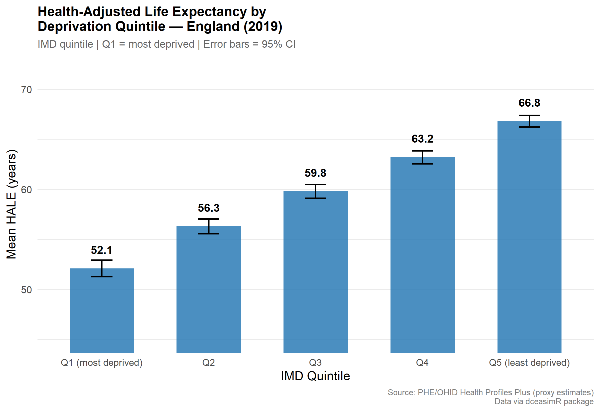
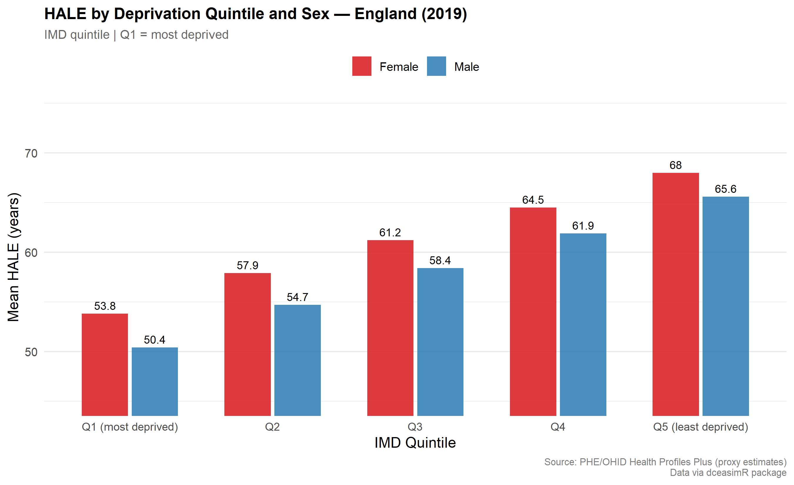

# dceasimR Exploration: Distributional Cost-Effectiveness Analysis

## Overview
This project explores the `dceasimR` R package, which implements 
Distributional Cost-Effectiveness Analysis (DCEA) methods endorsed 
by NICE (2025). The analysis uses preloaded England IMD quintile data 
and works through baseline inequality characterization, DCEA execution, 
and equity-efficiency trade-off interpretation.

## Repository Structure

```
├── 01_data_exploration.R       # EDA and inequality gap analysis
├── 02_dcea_analysis.R          # DCEA execution (in progress)
├── figures/
│   ├── 01_hale_by_quintile_overall.png
│   └── 02_hale_by_quintile_sex.png
└── README.md
```

## Key Finding: Baseline Inequality (England, 2019)
The most deprived quintile (Q1) has a mean HALE of 52.1 years versus 
66.8 years in the least deprived quintile (Q5) — an absolute gap of 
**14.7 years** (22% relative gap). The gradient is statistically 
significant at every quintile step, with the steepest drop occurring 
between Q1 and Q2 (4.2 years). Males carry a larger absolute gap 
(15.2 years) than females (14.2 years), despite females having higher 
HALE at every deprivation level.

## Visualizations

**Figure 1: Overall HALE by IMD Quintile**  


**Figure 2: HALE by IMD Quintile and Sex**  


## Data Source
Preloaded datasets from `dceasimR`: England IMD quintile HALE data 
(PHE/OHID Health Profiles Plus, proxy estimates, 2019).

## Methods Reference
Cookson R, Griffin S, Norheim OF, Culyer AJ (2020). *Distributional 
Cost-Effectiveness Analysis.* Oxford University Press.  
NICE (2025). Technology Evaluation Methods: Health Inequalities (PMG36).

## Status
- [x] Data exploration and quality verification  
- [x] Baseline inequality characterization  
- [x] HALE visualizations (overall + sex-disaggregated)  
- [ ] EQ-5D utility data exploration  
- [ ] DCEA execution with preloaded CEA example  
- [ ] Equity-efficiency impact plane  
- [ ] EDE sensitivity analysis

